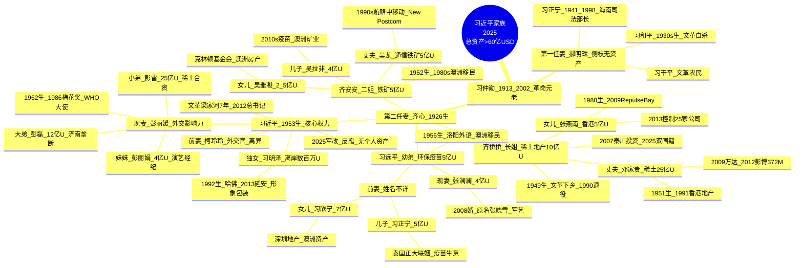

```mermaid
mindmap
  root((习近平家族<br/>2025<br/>总资产>60亿USD))
    习仲勋_1913_2002_革命元老
      第一任妻_郝明珠_侧枝无资产
        习和平_1930s生_文革自杀
        习干平_文革农民
        习正宁_1941_1998_海南司法部长
      第二任妻_齐心_1926生
        齐桥桥_长姐_稀土地产10亿U
          1949生_文革下乡_1990退役
          2007秦川投资_2025双国籍
          丈夫_邓家贵_稀土25亿U
            1951生_1991香港地产
            2009万达_2012彭博372M
          女儿_张燕南_香港5亿U
            1980生_2009RepulseBay
            2013控制25家公司
        齐安安_二姐_铁矿5亿U
          1952生_1980s澳洲移民
          丈夫_吴龙_通信铁矿5亿U
            1990s贿赂中移动_New Postcom
          女儿_吴雅凝_2_5亿U
            克林顿基金会_澳洲房产
          儿子_吴拉非_4亿U
            2010s疫苗_澳洲矿业
        习近平_1953生_核心权力
          文革梁家河7年_2012总书记
          2025军改_反腐_无个人资产
          前妻_柯玲玲_外交官_离异
          现妻_彭丽媛_外交影响力
            1962生_1986梅花奖_WHO大使
            大弟_彭磊_12亿U_济南垄断
            小弟_彭雷_25亿U_稀土合资
            妹妹_彭丽娟_4亿U_演艺经纪
          独女_习明泽_离岸数百万U
            1992生_哈佛_2013延安_形象包装
        习远平_幼弟_环保疫苗5亿U
          1956生_洛阳外语_澳洲移民
          前妻_姓名不详
            儿子_习正宁_5亿U
              泰国正大联姻_疫苗生意
            女儿_习欣宁_7亿U
              深圳地产_澳洲资产
          现妻_张澜澜_4亿U
            2008婚_原名张晓雪_军艺
```